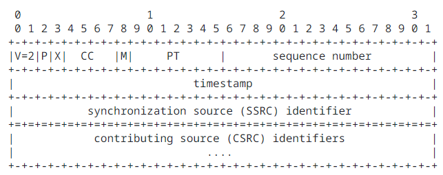

# RTP  (Real-time Transport Protocol) 协议

## 协议头格式

| 字段               | 长度(bits)  | 说明                                                         |
| ------------------ | ----------- | ------------------------------------------------------------ |
| `Version(V)`       | `2`         | RTP协议版本，取值总是为 2                                    |
| `padding(P)`       | `1`         | 这个位被设置的时候，数据包的末尾包含一个或多个附加的八位位组，这些八位位组不是有效载荷的一部分 |
| `extension(X)`     | `1`         | 是否带有扩展标头，为`1`表示带有扩展标头                      |
| `CSRC count(CC)`   | `4`         | `CSRC identifiers`的数量                                     |
| `marker(M)`        | `1`         | 应用等级以及其原型（`profile`）的定义。如果不为零表示目前的资料有特别的程序解译 |
| `payload type(PT)` | `7`         | `payload`的格式并决定将如何去由应用程式加以解译              |
| `sequence number`  | `16`        | 序列号                                                       |
| `timestamp`        | `32`        | 时间戳                                                       |
| `SSRC`             | `32`        | 同步源                                                       |
| `CSRS list`        | `CC` * `32` | 有效负载的贡献源                                             |
|                    |             |                                                              |

