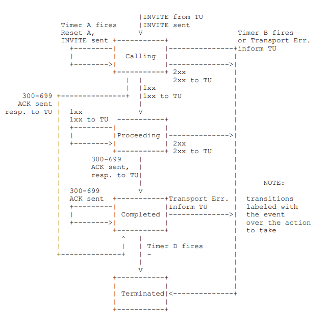
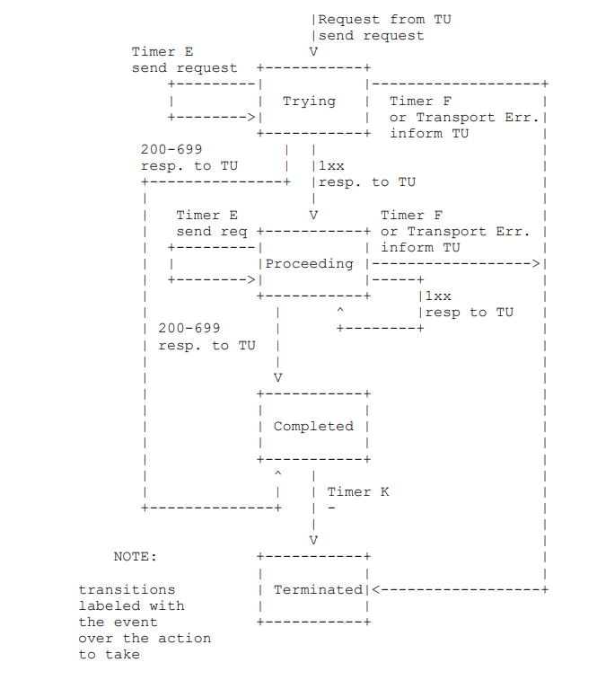
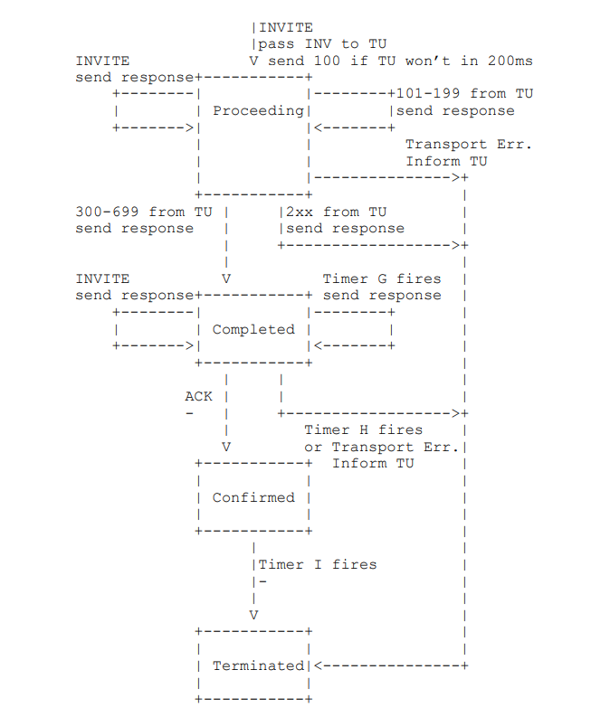
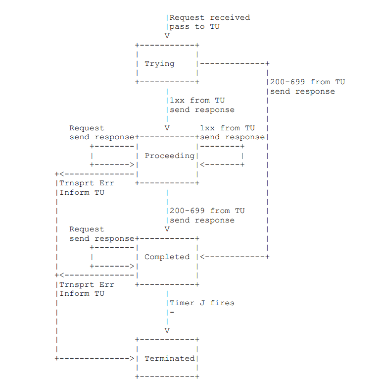

# SIP协议之7-Transactions(事务)

`SIP`是一种事务协议，组件之间的交互发生在一系列独立的消息交换中。具体来说，SIP事务由单个请求和对该请求的任意响应组成，其中包括0个或多个临时响应以及1个或多个最终响应

事务分为客户端事务和服务端事务，客户端事务发送请求，服务端事务发送响应

## 客户端事务

客户端事务通过维护状态机来提供功能。`TU `通过简单的接口与客户端事务进行通信, 当 `TU `希望发起新事务时，它将创建一个客户端事务并向其传递要发送的 `SIP `请求以及要发送该事务的 `IP `地址，端口和传输方式, 接着这个客户端事务开始运行其状态机，后面有效的客户端应答将从这个客户端事务传递回 `TU`

有两种类型的客户端事务状态机，这个取决于 `TU`传递的[请求的方法](./format.md), 一种类型是处理`INVITE`请求的客户端事务，这种类型被称为`INVITE`客户端事务，另一种是处理除了`INVITE`和`ACK`之外的所有请求的客户端事务，这种类型的客户端事务被称为非`INVITE`客户端事务，没有`ACK`客户端事务，如果`TU`希望发送`ACk`, 它将直接将其传递到传输层进行传输

`INVITE`事务与其他方法的不同之处在于它持续的时间比较长，通常需要人工输入才能响应 `INVITE`，发送响应预计会出现长时间延迟，因此需要进行三次握手，其他方法的请求预计会快速完成，因此非`INVITE`事务依赖于两次握手，`TU`应该直接响应非`INVITE`请求

### INVITE 客户端事务(ICT)

`INVITE`事务包括了三次握手，即: 客户端事务发送`INVITE`请求，然后服务端发送应答，最后客户端事务发送`ACk`

 对于不可靠的传输(例如`UDP`)，客户端事务以`T1`秒开始的时间间隔重新传输请求，并且在每次重传后间隔时间加倍，`T1`是一个预估的往返时间(即`TTL`)，默认值是 `500` 毫秒，此处描述的几乎所有事务计时器都与`T1`相关，可以通过改变`T1`的值来调整其他事务计时器的值，对于可靠的传输协议，请求不会被重传

在接收到`1xx`应答的时候，所有的定时器都会停止，客户端事务将等待更进一步的应答，事务端可以发送额外的`1xx`响应，这些响应不会由服务器事务可靠的传输，最终服务端事务发送最终的响应，对于不可靠的传输，响应被定时重转，对于可靠传输，响应仅被发送一次

对于接收到的每一个最终响应，客户端事务都会发送一个`ACk`，发送这个`ACk`的目的是为了告知服务端事务不再需要重传响应

#### ICT 状态机

如上，是`INVITE`客户端事务状态机，如下，是对状态机运行的详细描述

当`TU`通过`INVITE`请求发起一个新的客户端事务时，`TU`必须进入到`Calling`状态，客户端事务必须将请求传递给传输层进行传输，如果使用的是不可靠的传输协议，则客户端事务必须启动一个以`T1`作为启动值的定时器`A`, 而对应使用的是可靠的传输协议时，客户端事务不应该启动定时器`A`(因为定时器`A`控制请求的重传)，对于任意传输协议，客户端事务必须启动以`64 * T1`为启动值的定时器`B`(定时器`B`负责控制传输超时)

当定时器`A`触发的时候，客户端事务必须通过将请求传输到传输层进行重传，然后必须重置定时器`A`的值为`2 * T1`，在事务层中，重传的正式定义是获取先前发送到传输层的消息并将其再次传递给传输层，当定时器`A`在`2 * T1`秒后再次被触发时，请求必须再次被重传(假设客户端事务任处于次状态)，以此类推，每次定时器`A`被触发，请求都被重传，定时器`A`的值都会翻倍处理，这些重传应该仅在客户端事务处于`Calling`状态下进行

`T1`默认值为`500`毫秒，`T1`是客户端事务和服务端事务之间的一个`RTT`预估值，`T1`可以取更小的值，但是不推荐，如果事先知道`RTT`的预估值的话，`T1`也可以取更大的值(推荐这样子做)，不管`T1`的值是多少，必须使用本节中描述的重传指数进行操作(如每次定时器`A`被触发定时器的值都翻倍)

如果客户端事务一直处于`Calling`状态知道定时器`B`触发时，客户端事务应该上报`TU`发送一个超时事件，并且客户端事务不应该生成一个`ACK`，`64 * T1`的值等于在不可靠传输下重传  7 个请求的时间

如果客户端事务在`Calling`状态下接收到一个临时响应，客户端事务将切换到`Proceeding`状态，在`Proceeding`状态下，客户端事务不应该重传请求，另外，临时响应必须传递给`TU`, 任何进一步的 临时响应都应该在`Proceeding`状态下传递给`TU`

当`Calling`或`Proceeding`状态下，接收到一个`3xx - 6xx`的应答，客户端事务必须切换到`Completed`状态，客户端事务必须将接收到的响应传递给`TU`, 客户端事务必须生成一个`ACK`应答，即使传输是可靠的，然后生成的`ACK`应答通过传输层进行传输，`ACK`应答必须发送到与原始请求发送到的相同地址，端口和传输协议

如果客户端事务是从`Proceeding`状态进入到`Completed`状态，则应该启动一个定时器`D`, 对于不可靠传输，其初始值为`32`秒(客户端事务不知道服务端事务使用的`T1`值，因此使用了`32`秒(` 64 * 客户端事务的T1`)，而不是基于服务器`T1`)，对于可靠的传输，其初始值为`0`, 定时器`D`反映使用不可靠传输时，服务器事务应该保持`Completed`状态的时间，定时器`D`等价于`INVITE`服务端事务中初始值为`64 * T1`的定时器`H`

在`Completed`状态下，接收到的任何最终响应，都必须触发客户端事务`ACK`应答的重新传输，但新接收到的最终响应不被传输到`TU`，在`Completed`状态下，客户端事务触发定时器`D`时，客户端事务必须转换到`Terminated`状态，

在`Calling`或者`Proceeding`状态下，接收到`2xx`应答时，客户端事务必须转换到`Terminated`状态，并且响应必须传递到`TU`, 对`2xx`的处理依赖于`TU`是一个`proxy`核心还是`UAC`核心，对于`UAC`核心，会生成一个`ACK`请求去应答`2xx`响应，对于`proxy`核心，总是传发这个`2xx`响应

为了保证操作的正确性，客户端事务在必须进入到`Terminated`状态后进行销毁，原因是对`INVITE`的`2xx`响应被不同地对待，每一个通过`proxy`传发的`2xx`响应，`UAC`的`ACK`处理是不一样的，因此，每个`2xx`影响都被传递给`proxy`核心(为了进行传发)和`UAC`核心(为了进行确认)

每当接收到一个响应的时候，如果传输层找不到对应的客户端事务，响应被直接传输到核心，如前所述，在接收到第一个`2xx`响应的时候，客户端事务将被销毁，后续接收到的`2xx`响应不会被匹配到，因此将被直接传输到核心

#### ACK请求的构建

`UAC`核心中对于`2xx`响应生成`ACK`请求的规则请参考[SIP协议之5-会话初始化](./session_terminate.md), 客户端会话生成的`ACK`请求必须包含`Call-ID`, `From`,以及`Request-URI`字段，这些值等于客户端事务传递给传输的请求中这些标头字段的值(即和接收到的请求报文中的相同字段保持一致)

`ACK`请求中，必须包含一个和原始请求一样的`Via`头部，`ACK`中的`CSeq`头必须包含和原始请求中存在的序列号相同的值，但`Method`参数需要变成`ACK`

如果需要响应`ACK`请求的原始报文是`INVITE`请求，并且`INVITE`请求中带有`Route`字段，则这些字段也必须出现在`ACK`请求中，这是为了保证`ACK`可以通过任何下游无状态代理正确路由

尽管任何请求都可以包含消息主体部分，但`ACk`中的消息主体很特殊，因为如果消息主体部分不被理解的话，则无法拒绝请求，因此在应答非`2xx`响应的`ACK`请求中，放置消息主体部分是不推荐的

### 非INVITE客户端事务(NICT)

#### NICT状态机

如上，是非`INVITE`客户端事务状态机，如下，是非`INVITE`客户端事务的详细描述

非`INVITE`事务不会使用`ACK`去确认应答，他们就是简单的请求-响应式的交互，对于不可靠的传输，请求会按照从`T1`开始加倍直到`T2`的时间间隔进行重传，如果接收到一个临时的响应，对于不可靠传输，重传还会继续，但时间间隔立刻变成 `T2`。仅当收到重传请求时，服务端事务才会重传最后一次发送的响应，这个响应可以是临时响应或最终响应，这也是为什么在收到一个临时响应之后，重传依然要继续的原因，这个要确保最终响应被可靠地传送到

与`INVITE`事务不同，一个非`INVITE`事务对`2xx`响应没有进行任何特殊处理，结果是只有一个非`INVITE`的`2xx`响应被传递到`UAC`

如图，在`TU`通过请求发起一个新的客户端事务后，将进入`Trying`状态，在该状态下，客户端事务应该将计时器`F`设置为在`64 * T1`秒后触发，请求必须通过传输层进行传输，如果使用的是不可靠的传输，客户端事务必须设置定时器`E`在`T1`秒后触发，如果定时器`E`在`Trying`状态下触发，定时器将被重置，但这次的值变为`MIN(2 * T1， T2)`, 再次被触发时，定时器的值变为`MIN(4 * T1, T2)`, 这个过程将会一直以指数的形式持续增加重传的间隔，直到`T2`为止。默认的`T2`值为`4`秒，它表示非`INVITE`下服务器事务在不立即响应的情况下，响应请求所需的时间，在使用`T1`和`T2`默认值的情况下，定时器`F`的间隔为`500ms, 1s, 2s ,4s, 4s, 4s ...`

客户端事务在`Tring`状态下，如果定时器`F`在触发，客户端事务应该上报`TU`定时器超时，然后进入到`Terminated`状态；如果接收到一个临时响应，接收到的响应必须传递给`TU`，然后切换到`Proceeding`状态；如果接收到一个最终响应(状态码为`200-699`)，响应必须传递给`TU`，然后客户端事务必须切换到`Completed`状态

在`Proceeding`状态下，如果定时器`E`触发，请求必须通过传输层重传，然后定时器`E`必须被重置为`T2`秒；如果定时器`F`触发，`TU`必须上报定时器超时，然后必须切换到`Terminated`状态；如果接收到一个最终响应(状态码为`200-699`), 响应必须传递给`TU`，然后客户端事务切换到`Completed`状态

一旦客户端事务进入到`Completed`状态，对于不可靠的传输，定时器`K`必须在`T4`秒之后触发，对于可靠传输，定时器`K`触发时间时间为`0`(即不设置触发), `Completed`状态的存在是为了缓冲可能收到的任何额外的响应重传(这就是为什么客户端事务仅在不可靠的传输中保留在这里的原因)，`T4`表示网络清除客户端和服务端事务之间消息所需的时间，默认是`5`秒，根据下一节中的规则，当响应与同一事务匹配时，响应就是重传，在`Completed`状态下，如果定时器`K`被触发，则客户端事务必须进入到`Terminated`状态

一旦一个事务进入到`Terminated`状态，它就必须被立即销毁

### 响应匹配客户端事务

 当客户端传输层接收到一个响应时，就需要确定哪个客户端事务将处理响应，以便根据状态机中提到的流程进行处理，`SIP`消息中的`Via`头部中的`branch`参数就是用来做这个事的。

一个响应在如下两种情况下与客户端事务匹配：

1.   响应的`Via`头部中`branch`参数与创建事务时的`Via`头部中的`branch`参数相同
2.   如果`CSeq`头部中的`Method`参数与创建事务时的`Method`方法相同，需要该方法是因为`CANCEL`请求构成不同的事务，当共享`branch`参数相同值

如果通过多播的方式发送请求，则可能会接收到多个来自不同服务器的响应，这些响应在`Via`头部中都具有相同的值，但是`To`标签中的`tag`标记不同，在第一个响应被接收之后，根据上述规则，将使用收到的第一个响应，其他响应将被视为重传，这不是一个错误，多播`SIP`仅提供基本的"单跳发现式"服务，仅限于处理单个响应

### 传输出错处理

当客户端事务向传输层发送请求的时候，如果传输层指示失败，则需要遵循以下流程

客户端事务应该将传输错误上报给`TU`，然后客户端事务，应该直接切换到`Terminated`状态，`TU`会根据状态机中描述的故障转移机制进行处理

## 服务端事务

服务端事务负责发现向`TU`发送的请求并可靠地传输响应，这个通过状态机来实现。在核心在接收到一个请求之后，服务端事务将被创建，然后服务端事务将处理接收到的请求(并不总是这样子，也有例外)，与客户端事务一样，状态机取决于接收到的请求是否是`INVITE`请求

### INVITE服务端事务(IST)

#### IST状态机

如上图，是`INVITE`服务端事务状态机，如下是`INVITE`服务端事务的详细描述

当接收到一个请求之后`INVITE`服务端事务将被创建，然后`INVITE`服务端事务将进入到`Proceeding`状态，服务端事务必须生成一个`100(Trying)`响应，除非服务端事务知道`TU`将在`200`毫秒内生成一个临时或者最终响应，在这种情况下，它可以生成一个`100(Trying)`响应，临时响应的作用是终止客户端事务的请求重传，以避免网络拥塞。

请求必须传递到`TU`

`TU`将任意数量的临时响应传递给服务器事务，只要服务器事务处于`Proceeding`状态，每个事务都必须传递到传输层进行传输，它们不是由事务层可靠的传输(它们不会被事务层重传)并且不会导致服务器事务状态的变化

在`Proceeding`状态下，如果接收到一个请求重传，从`TU`收到的最新临时响应必须传递到传输层进行重传，一个请求是不是重传的，可以根据后续的*服务端事务请求匹配*一节中提到的规则进行判断

在`Proceeding`状态下，`TU`将`2xx`响应传递给服务器事务，服务器事务必须将此响应传递给传输层进行传输，`2xx`响应不会被服务器事务重传，重传`2xx`响应由`TU`进行处理，响应完`2xx`之后，服务器事务必须切换到`Terminated`状态

在`Proceeding`状态下，如果`TU`将状态码为`300-699`的响应传递给服务器事务，响应必须传输到传输层进行传输，然后状态机状态必须切换到`Completed`状态，对于不可靠的传输，定时器`G`将在`T1`秒后触发，对于可靠传输，则不设置触发(对于`RFC 2543`来说，响应总是被重传，即使是可靠的传输)

在进入到`Completed`状态后，定时器`H`必须被设置，对于所有的传输触发时间都被设置为`64 * T1`，定时器`H`用于确定服务器事务什么时候放弃重传响应，它的值与定时器`B`的取值一样，即客户端事务将继续重试发送请求的时间间隔

在`Completed`状态下，如果定时器`G`触发，响应将再次传递到传输层并进行重传，并且定时器`G`设置为`MIN(2 * T1, T2)`秒内触发，从这时器，定时器`G`在每次被触发的时候，影响都会被重传，定时器`G`的触发间隔都会按指数增加，直到值超过`T2`为止，之后就会一直以`T2`的重传间隔重置定时器`G`, 这与非`INVITE`客户端事务`Trying`状态下的请求重传行为相同

此外，在`Completed`状态下，如果一个请求重传被接收到，服务端应该将响应传递给传输层进行重传

在`Completed`状态下，如果服务端事务接收到一个`ACK`请求，服务端事务必须切换到`Confirmed`状态，在这个状态下，定时器`G`将被忽略，任何响应的重传都被停止

在`Completed`状态下，如果定时器`H`被触发，这意味着`ACK`没有被接收到，这这种情况下，服务端事务必须切换到`Terminated`状态，并且必须向`TU`指示事务已经发生失败。 

`Confirmed`状态的目的是接收最终响应重传的触发的任何到达的附加`ACK`消息，当进入这个状态之后，定时器`I`被设置，对于不可靠传输，触发时间被设置为`T4`，对于可靠传输，触发时间被设置为0(即不触发)，一旦定时器`I`触发，服务端必须切换到`Terminated`状态

一旦事务进入到`Terminated`状态，与客户端事务一样，为了确保对`INVITE`的`2xx`响应的可靠性，服务端事务将被立即销毁

### 非INVITE服务端事务(NIST)

#### NIST 状态机

如上，是非`INVITE`服务端事务状态机，如下，是非`INVITE`服务端事务状态机的详细描述

状态在初始化状态为`Trying`状态，并在初始化状态下传递除`INVITE`或`ACk`之外的请求，接收的请求被传递到`TU`。一旦进入`Trying`状态，任何进一步的重传请求都会被丢弃。一个请求是不是重传请求，可以根据后续的*服务端事务请求匹配*一节中提到的规则进行判断

在`Trying`状态下，如果`TU`将临时响应传递给服务端事务，则服务端事务必须切换到`Proceeding`状态，响应必须被传递到传输层进行传输。在`Proceeding`状态下，从`TU`接收到的任何更进一步的临时响应必须传递到传输层进行传输。

在`Proceeding`状态下，如果接收到一个重传请求，最近发送的临时响应必须传递到传输层进行重传。如果`TU`在`Proceeding`状态下向服务端传递最终响应(状态码为`200-699`)，则事务必须切换到`Completed`状态，并且响应必须传递到传输层进行传输。

当服务端事务进入到`Completed`状态时，定时器`J`必须被设置，并且对于不可靠传输来说，设置为`64 * T1`秒后触发，对于可靠传输来说，设置为0秒触发(即不触发)，在`Completed`状态下，每当收到重传请求时，服务端事务必须将最终响应传递给传输层进行重传，而`TU`传递给服务端事务的的任何其他最终响应都必须被丢弃。

服务端事务保持在`Completed`状态下，直到定时器`J`触发，此时服务端事务切换到`Terminated`状态

进入`Terminated`状态后，服务端事务必须被销毁。

### 服务端事务请求匹配

当服务端从网络接收到请求时，必须与现有事务进行匹配，这是通过如下方式进行的

检查请求中[消息头部](./format.md)部分中的`Via`头部中的`branch`参数值，如果他存在并且以`z9hG4bK`开头的魔数，则该请求是由符合此规范的客户端事务生成的，因此，`branch`参数在该客户端发送的所有事务中都是唯一的，如果满足以下条件，则该请求与事务匹配：

1.   请求中的`branch`参数等于创建事务的请求的`Via`头部字段中的参数值，并且
2.   请求中的`Via`头部字段中的`send-by`值等于创建事务的请求中的值，并且
3.   请求的方法与创建事务的除`ACk`方法之外的方法匹配，其中创建事务的请求的方法为`INVITE`

以上匹配规则对于`INVITE`服务端事务或者非`INVITE`服务端事务都有效

`send-by`的值用于匹配过程的一部分，是因为来自不同客户端的`branch`参数可能会意外或恶意的重复

如果`Via`头部字段中的`branch`参数中不存在或者不包含`z9hG4bK`魔数，则使用如下过程，它们的存放是为了与`RFC 2543`兼容实现的先后兼容

如果消息头部中的`Request-URI`, `To`头部的`tag`，`From`头部的`tag`，`Call-ID`，`CSeq`以及`Via`头部字段与创建事务的`INVITE`请求相同的字段匹配，则`INVITE`请求与事务匹配，在这种情况下，`INVITE`是创建事务的原始`INVITE`的重传。

如果消息头部中的`Request-URI`，`From`头部的`tag`，`Call-ID`号，`CSeq`号(不包括方法)和`Via`头部字段与创建事务的`INVITE`请求以及`ACK`请求中`To`头部与服务器事务中的`To`头部匹配，则`ACK`请求与事务匹配

在`ACk`匹配过程中，在`To`头部中添加`tag`参数有助于在`proxy`下消除`2xx`的`ACK`和其他响应的`ACK`的歧义，`proxy`有可能已经转发这两个响应(这可能会在异常情况下发生，具体来说，当代理`forked`请求之后崩溃，响应可能会传递到另一个`proxy`, 这可能最终会向上游传发多个响应)，与先前`ACK`匹配的`INVITE`事务相匹配的`ACK`请求被视为先前`ACK`的重传

对于所有其他请求方法，如果`Request-URI`， `To`头部的`tag`，`From`头部的`tag`，`Call-ID`，`CSeq`(包括`Method`)以及`Via`头部字段与创建事务时请求的字段匹配，则请求与事务匹配。

匹配是根据为每个标头字段定义的匹配规则完成的。当非`INVITE`请求与现有事务匹配时，它是创建给事务的请求的重传

因为匹配规则中包含了`Request-URI`，因此服务端无法匹配事务的响应，当`TU`将响应传递给服务端事务时，它必须将其传递给响应所针对的特定服务端事务

### 传输错误处理

当一个服务端事务发送一个响应到传输层进行传输的时候，如果传输层返回了一个错误，则遵循以下处理过程

首先，遵循 [1] 中的过程，尝试将响应传递备份，如果这些都失败了，根据 [1] 中失败的定义，服务端事务应该上报`TU`发生了一个失败，事务应该进入到`Terminated`状态

\[1\]: [`Session Initiation Protocol (SIP): Locating SIP Servers`](https://www.rfc-editor.org/rfc/rfc3263)
